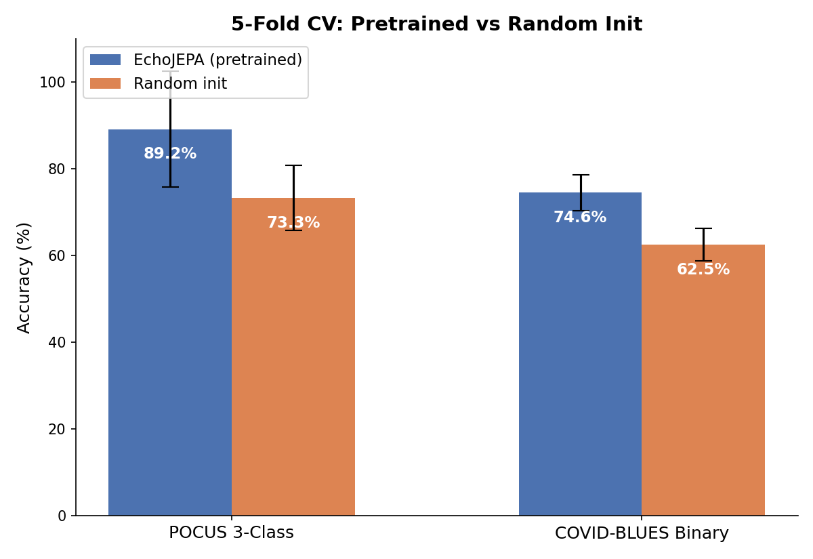
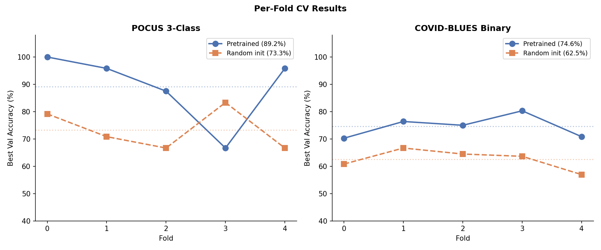
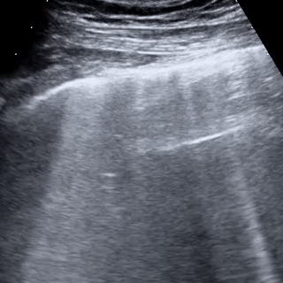
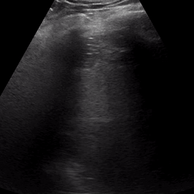
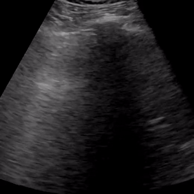
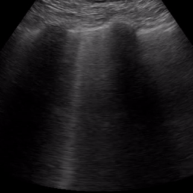
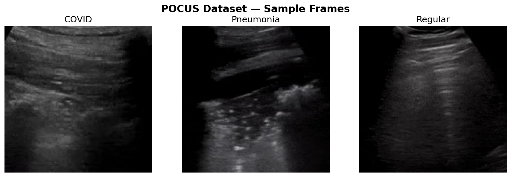
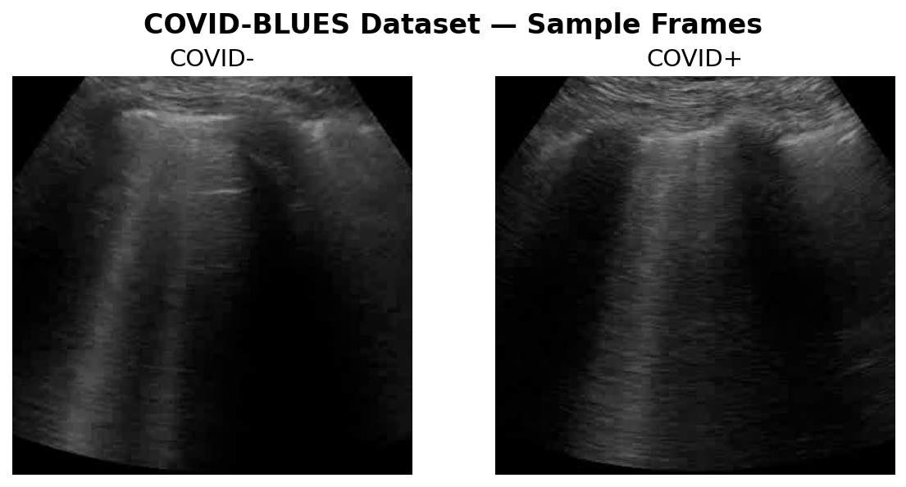
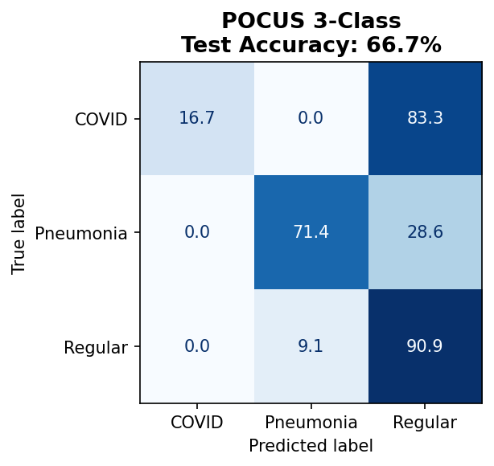
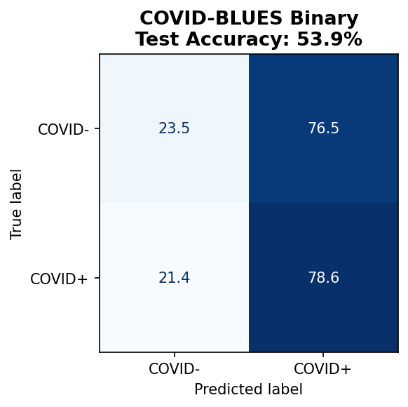

# EchoLung

**Cross-anatomy transfer learning: cardiac echocardiography SSL to lung ultrasound classification**

Self-supervised representations learned from cardiac echo videos transfer effectively to lung ultrasound classification, even with very few labeled samples. We use EchoJEPA (V-JEPA2 ViT-L with RoPE) pretrained on 17,840 cardiac echo videos, then evaluate frozen attentive probes on two lung US benchmarks.

## Key Results

| Dataset | EchoJEPA (pretrained) | Random Init | Transfer Gain |
|---------|----------------------|-------------|---------------|
| POCUS 3-class | **89.2% +/- 13.4%** | 73.3% +/- 7.6% | **+15.9%** |
| COVID-BLUES binary | **74.6% +/- 4.1%** | 62.5% +/- 3.8% | **+12.1%** |

*5-fold patient-level stratified cross-validation. Frozen ViT-L backbone + attentive probe.*





## Pipeline

```
V-JEPA 2 ViT-L (Meta, public weights)
  | continue SSL pretraining (100 epochs)
Domain-adapted EchoJEPA-L (17,840 cardiac echo videos)
  | freeze backbone + train attentive probe
Lung US classification (POCUS 3-class, COVID-BLUES binary)
```

## Datasets

### Pretraining (cardiac echo, unlabeled)

| Source | Videos | View |
|--------|--------|------|
| EchoNet-Dynamic | 10,030 | A4C |
| EchoNet-Pediatric A4C | 3,284 | A4C |
| EchoNet-Pediatric PSAX | 4,526 | PSAX |
| **Total** | **17,840** | |

### Downstream (lung US, labeled)

| Dataset | Videos | Patients | Task | Classes |
|---------|--------|----------|------|---------|
| POCUS convex | 122 | - | Pathology | COVID / Pneumonia / Regular |
| COVID-BLUES | 362 | 63 | COVID diagnosis | COVID+ / COVID- |

#### POCUS Samples

| COVID | Pneumonia | Regular |
|:-----:|:---------:|:-------:|
|  |  |  |

#### COVID-BLUES Samples

| COVID+ | COVID- |
|:------:|:------:|
|  |  |

<details>
<summary>Static frame samples</summary>





</details>

## Cross-Validation Results

### POCUS 3-Class (COVID / Pneumonia / Regular)

| | Pretrained | Random Init |
|---|-----------|-------------|
| Fold 0 | 100.0% | 79.2% |
| Fold 1 | 95.8% | 70.8% |
| Fold 2 | 87.5% | 66.7% |
| Fold 3 | 66.7% | 83.3% |
| Fold 4 | 95.8% | 66.7% |
| **Mean +/- Std** | **89.2% +/- 13.4%** | **73.3% +/- 7.6%** |

### COVID-BLUES Binary (COVID+ / COVID-)

| | Pretrained | Random Init |
|---|-----------|-------------|
| Fold 0 | 70.3% | 60.8% |
| Fold 1 | 76.4% | 66.7% |
| Fold 2 | 75.0% | 64.5% |
| Fold 3 | 80.3% | 63.6% |
| Fold 4 | 70.8% | 56.9% |
| **Mean +/- Std** | **74.6% +/- 4.1%** | **62.5% +/- 3.8%** |

### Training Curves


### Test Set Confusion Matrices

Single train/val/test split evaluation on held-out test sets:





### Negative Result: Severity Classification

COVID-BLUES 4-class severity (scores 0-3) achieved only **7.9% test accuracy** with the frozen probe, indicating that fine-grained severity distinctions are not captured by the frozen cardiac echo representations. This is expected: severity scoring requires subtle B-line quantification that differs substantially from the motion/structure patterns learned from echocardiography.

## SSL Pretraining

100 epochs on 17,840 cardiac echo videos (EchoNet-Dynamic + EchoNet-Pediatric).

- Architecture: V-JEPA2 ViT-L (24 blocks, 1024-dim, RoPE positional encoding)
- Input: 16 frames at 224x224, tubelet size 2x16x16
- Loss: 0.575 -> 0.492

## Setup

```bash
# Install with uv (recommended)
uv sync

# Or with pip
pip install -e .
```

Symlink the pretrained checkpoint:
```bash
mkdir -p checkpoints
ln -s /path/to/vitl.pt checkpoints/vitl.pt
```

## Data Preparation

```bash
# 1. Combined pretraining pool
uv run python data/prepare_pretrain_combined.py \
    --dynamic_dir /path/to/EchoNet-Dynamic \
    --pediatric_dir /path/to/pediatric_echo_avi

# 2. POCUS lung US (3-class)
uv run python data/prepare_pocus.py \
    --pocus_dir /path/to/pocus_videos/convex

# 3. COVID-BLUES (binary + severity + 5-fold CV)
uv run python data/prepare_covid_blues.py \
    --blues_dir /path/to/COVID-BLUES \
    --cv_folds 5
```

## Training

### SSL Pretraining

```bash
uv run python -m app.main \
    --fname configs/4090/train/pretrain-echonet-224px-16f.yaml \
    --devices cuda:0
```

### 5-Fold Cross-Validation

```bash
# POCUS pretrained
bash scripts/run_pocus_cv.sh

# POCUS random-init baseline
bash scripts/run_pocus_cv_randinit.sh

# COVID-BLUES pretrained
bash scripts/run_covid_blues_cv.sh

# COVID-BLUES random-init baseline
bash scripts/run_covid_blues_cv_randinit.sh
```

### Aggregate Results

```bash
# POCUS
uv run python scripts/aggregate_cv.py \
    --cv_dir experiments/eval/pocus_cv \
    --tag echojepa-vitl-pocus-cv \
    --output results/pocus_cv_summary.json

# COVID-BLUES
uv run python scripts/aggregate_cv.py \
    --cv_dir experiments/eval/covid_blues_cv \
    --tag echojepa-vitl-covid-blues-cv \
    --output results/covid_blues_cv_summary.json
```

### Generate Figures

```bash
uv run python scripts/generate_paper_figures.py
```

## Project Structure

```
configs/           # YAML configs for pretraining and evaluation
data/              # Data preparation scripts and CSV splits
  csv/             # Train/val/test split CSVs
evals/             # Evaluation framework (frozen probe)
figures/           # Generated figures (bar charts, confusion matrices, samples)
results/           # JSON summaries and prediction CSVs
scripts/           # CV runners, aggregation, figure generation
src/               # Core model and training code
```

## Checkpoints

Pretrained checkpoints are available on [HuggingFace](https://huggingface.co/Dimios45/echolung).

## Citation

If you use this work, please cite:

- [V-JEPA 2](https://arxiv.org/abs/2412.04468) (Bardes et al., 2024)
- [EchoNet-Dynamic](https://echonet.github.io/dynamic/) (Ouyang et al., 2020)
- [POCUS Dataset](https://github.com/jannisborn/covid19_ultrasound) (Born et al., 2020)
- [COVID-BLUES](https://zenodo.org/records/6373057) (Roshankhah et al., 2022)
