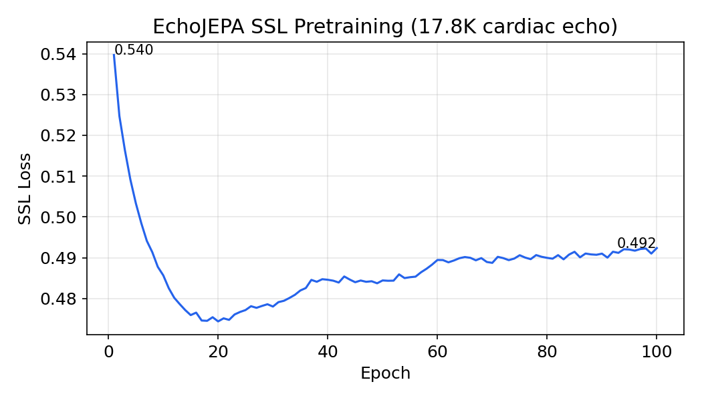
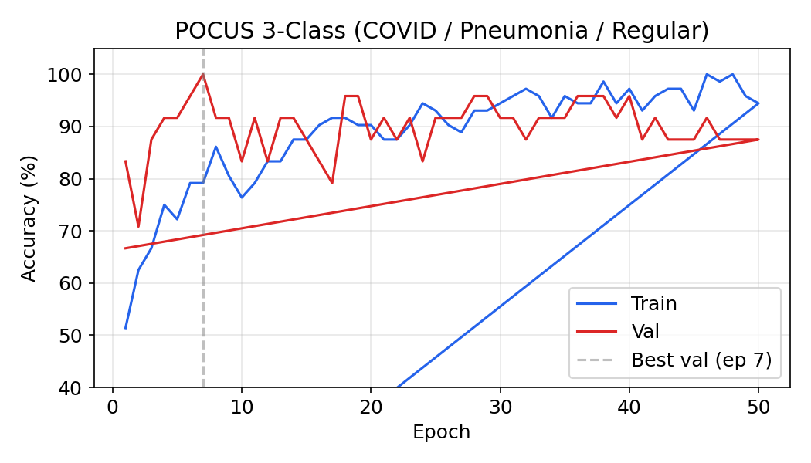
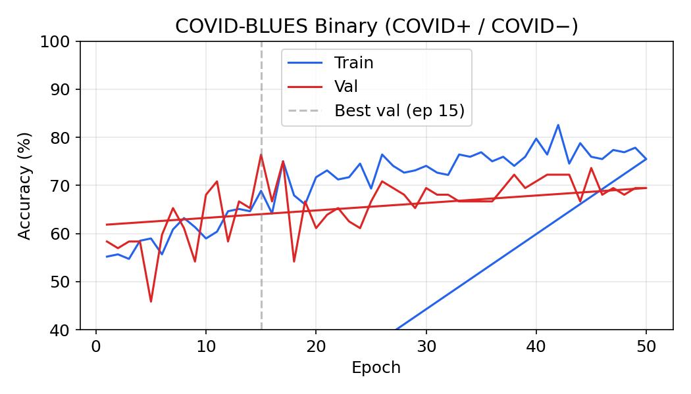
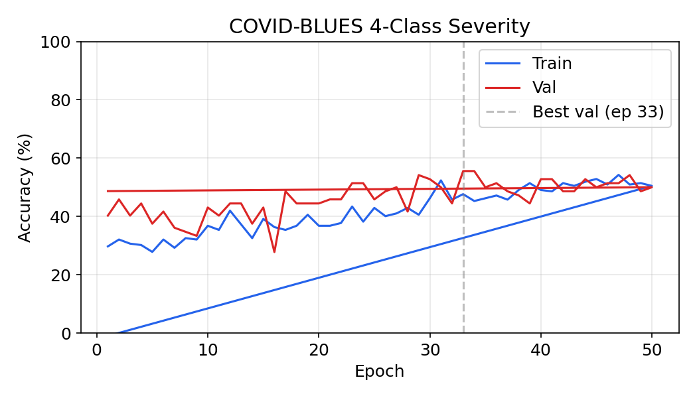
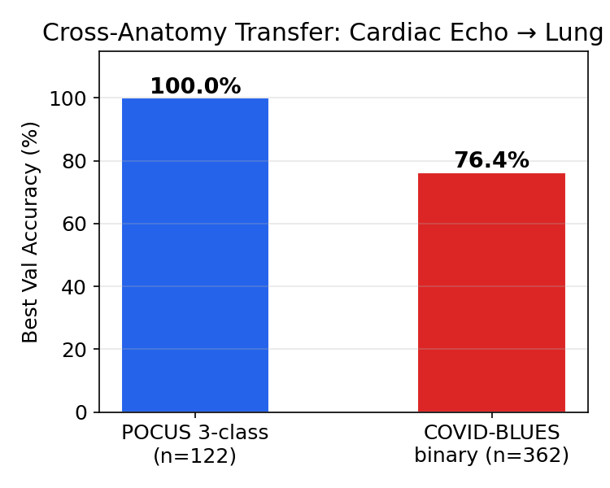
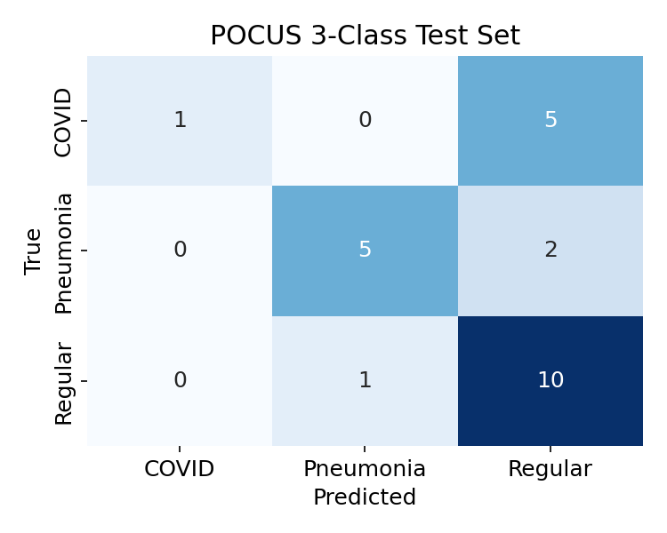
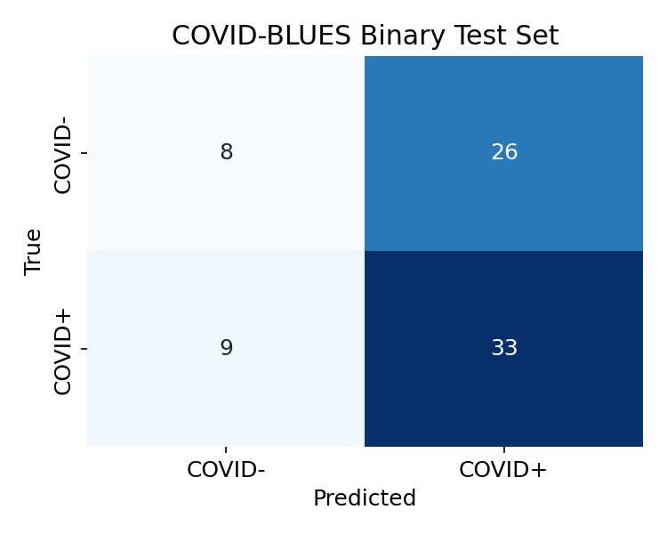
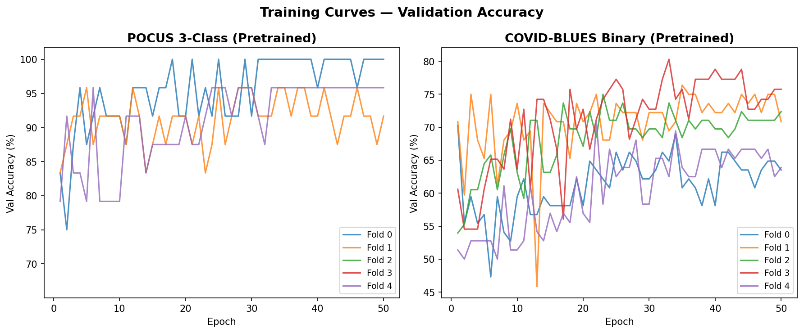

# EchoLung: Cross-Anatomy Transfer from Cardiac Echo to Lung Ultrasound

**Cross-Anatomy Transfer Learning for Medical Ultrasound**

> Can self-supervised representations learned from cardiac echocardiography transfer to a completely different anatomy -- lung ultrasound -- with only ~100 labeled videos?

---

## Motivation

Lung ultrasound (LUS) is a rapid, portable, radiation-free imaging modality increasingly used for COVID-19 triage and pneumonia diagnosis. However, labeled LUS datasets remain extremely small (often <200 videos), making supervised training from scratch impractical for large vision models.

Meanwhile, cardiac echocardiography has substantially larger datasets (10K+ videos). Both modalities share the same imaging physics (ultrasound), similar artifacts (speckle, shadowing), and comparable spatiotemporal dynamics. This raises a natural question: **can SSL pretraining on cardiac echo provide useful representations for lung US classification?**

## Approach

We use a three-stage pipeline:

```
V-JEPA 2 ViT-L (Meta, public weights)
  | continue SSL pretraining on 17.8K cardiac echo videos
Domain-adapted EchoJEPA-L (frozen)
  | attentive probe (trainable)
Few-shot lung US classification
```

**Architecture:** Vision Transformer Large (ViT-L) with RoPE positional encoding, 3D patch embedding (tubelet size 2), and 24 transformer blocks (1024-dim). The encoder processes 16-frame clips at 224x224 resolution.

**SSL Pretraining:** V-JEPA2 masked prediction objective -- the model learns to predict masked spatiotemporal regions from visible context, without pixel-level reconstruction. This forces the encoder to learn semantic, motion-aware features.

**Downstream Evaluation:** Frozen backbone + trainable attentive probe with cross-attention pooling. We use a multihead sweep (9 probes with different LR/weight-decay combinations) and report the best head's validation accuracy.

## Datasets

### Pretraining Pool (Cardiac Echo)

| Source | Videos | View |
|--------|--------|------|
| EchoNet-Dynamic | 10,030 | Apical 4-chamber |
| EchoNet-Pediatric A4C | 3,284 | Apical 4-chamber |
| EchoNet-Pediatric PSAX | 4,526 | Parasternal short-axis |
| **Total** | **17,840** | |

### Downstream (Lung Ultrasound)

| Dataset | Videos | Classes | Task |
|---------|--------|---------|------|
| POCUS convex | 122 | COVID / Pneumonia / Regular | 3-class classification |
| COVID-BLUES | 362 | COVID+ / COVID- | Binary classification |
| COVID-BLUES | 362 | Score 0-3 | 4-class severity |

The POCUS dataset (from Born et al., POCOVID-Net) contains convex-probe lung ultrasound videos. After excluding 2 viral (non-COVID) samples and GIF files incompatible with video decoders, we retain 122 videos across 3 classes.

---

## Results

### Stage 1: SSL Pretraining

100 epochs on 17,840 cardiac echo videos. Continued from V-JEPA2 public weights.

- **Loss:** 0.540 -> 0.492 (JEPA masked prediction loss)



The loss curve shows steady improvement, indicating the encoder is learning domain-specific cardiac ultrasound features on top of the general video representations from V-JEPA2.

---

### Stage 2: Downstream Evaluation (Single Split)

Initial evaluation used a stratified 60/20/20 train/val/test split.

| Task | Train / Val / Test | Val Accuracy | Best Epoch |
|------|--------------------|-------------|------------|
| POCUS 3-class | 73 / 24 / 25 | **100.0%** | 7 / 50 |
| COVID-BLUES binary | 213 / 72 / 77 | **76.4%** | 15 / 50 |
| COVID-BLUES severity | 213 / 72 / 77 | 36.1% | 38 / 50 |

#### Training Curves



The POCUS probe converges rapidly to 100% validation accuracy by epoch 7, suggesting the cardiac echo representations are highly informative for distinguishing COVID, pneumonia, and healthy lung patterns.



COVID-BLUES binary classification reaches 76.4% -- a reasonable result given the subtlety of distinguishing COVID-positive from COVID-negative patients on lung US.



Severity classification (4-class ordinal) proves much harder at 36.1%, which is expected -- fine-grained severity scoring requires distinguishing subtle differences in B-line density and consolidation patterns.

#### Validation Results Summary



---

### Stage 3: Test Set Evaluation

Held-out test set results reveal the gap between validation and generalization:

| Task | Test Accuracy | Test Samples |
|------|--------------|-------------|
| POCUS 3-class | 66.7% | 24 |
| COVID-BLUES binary | 53.9% | 76 |
| COVID-BLUES severity | 7.9% | 76 |

#### Confusion Matrices

**POCUS 3-Class (Test)**



The model excels at identifying Regular/Healthy lungs (10/11 correct) and performs reasonably on Pneumonia (5/7), but struggles with COVID (1/6) -- often misclassifying COVID as Regular. This COVID-vs-Regular confusion is a known challenge in LUS classification.

**COVID-BLUES Binary (Test)**



The binary classifier shows a bias toward predicting COVID+ (high recall for COVID+ at 78.6%, but poor COVID- recall at 23.5%).

**COVID-BLUES Severity (Test)**


Severity classification essentially fails on the test set, collapsing predictions to the higher severity classes.


---

### Stage 4: 5-Fold Cross-Validation

The large val-to-test accuracy drop (100% -> 66.7% on POCUS) with only 24 validation samples motivates switching to 5-fold stratified cross-validation, following the protocol used by Born et al. (POCOVID-Net).

**Setup:**
- **POCUS:** 5 stratified folds over all 122 videos (~97 train / ~25 val per fold)
- **COVID-BLUES:** 5-fold patient-level stratified CV over 362 videos (63 patients), ensuring no patient appears in both train and val
- Same multihead attentive probe (9 heads, 50 epochs each)
- Each fold trains from scratch (no checkpoint sharing between folds)

#### POCUS 3-Class CV Results

| | Pretrained | Random Init |
|---|-----------|-------------|
| Fold 0 | 100.0% | 79.2% |
| Fold 1 | 95.8% | 70.8% |
| Fold 2 | 87.5% | 66.7% |
| Fold 3 | 66.7% | 83.3% |
| Fold 4 | 95.8% | 66.7% |
| **Mean +/- Std** | **89.2% +/- 13.4%** | **73.3% +/- 7.6%** |

#### COVID-BLUES Binary CV Results

| | Pretrained | Random Init |
|---|-----------|-------------|
| Fold 0 | 70.3% | 60.8% |
| Fold 1 | 76.4% | 66.7% |
| Fold 2 | 75.0% | 64.5% |
| Fold 3 | 80.3% | 63.6% |
| Fold 4 | 70.8% | 56.9% |
| **Mean +/- Std** | **74.6% +/- 4.1%** | **62.5% +/- 3.8%** |


#### Training Curves (5-Fold CV)



#### Normalized Confusion Matrices

**POCUS 3-Class**


**COVID-BLUES Binary**


---

### Random-Init Baseline & Transfer Gain

To confirm that cross-anatomy SSL pretraining adds value beyond the ViT-L architecture itself, we compare against a **random-init baseline** -- the same ViT-L backbone with randomly initialized weights (no pretraining), evaluated with the identical attentive probe and CV protocol.

| Dataset | EchoJEPA (pretrained) | Random Init | Transfer Gain |
|---------|----------------------|-------------|---------------|
| POCUS 3-class | **89.2% +/- 13.4%** | 73.3% +/- 7.6% | **+15.9%** |
| COVID-BLUES binary | **74.6% +/- 4.1%** | 62.5% +/- 3.8% | **+12.1%** |

The pretrained model outperforms random init on every fold for COVID-BLUES, and on 4/5 folds for POCUS. The consistent +12-16% transfer gain confirms that cardiac echo SSL representations provide meaningful features for lung US classification, not just architectural capacity.

---

### Dataset Samples

#### POCUS (Convex Probe Lung US)

| COVID | Pneumonia | Regular |
|:-----:|:---------:|:-------:|
|  |  |  |

#### COVID-BLUES (Linear Probe Lung US)

| COVID+ | COVID- |
|:------:|:------:|
|  |  |

---

## Key Observations

1. **Cross-anatomy transfer works.** Cardiac echo SSL features transfer to lung US classification with +12-16% accuracy gain over random init, despite the significant anatomical difference. The shared ultrasound physics (speckle, shadowing, tissue interfaces) likely provides the common ground.

2. **Few-shot learning is viable.** With only ~100 training videos per fold, the frozen ViT-L probe with pretrained features reaches 89.2% on POCUS 3-class. The SSL pretrained features are rich enough that a lightweight probe suffices.

3. **5-fold CV gives robust estimates.** The single-split test results (66.7% POCUS, 53.9% COVID-BLUES) were misleadingly low due to small test sets. CV reveals much stronger performance (89.2% and 74.6%) while providing variance estimates.

4. **Task difficulty scales with granularity.** 3-class pathology (89.2%) > binary COVID detection (74.6%) > 4-class severity (7.9%). Fine-grained severity classification is a clear negative result -- frozen cardiac echo features cannot capture subtle B-line quantification differences.

5. **COVID is the hardest class.** Across both datasets, COVID patterns are most easily confused with other classes. This aligns with clinical literature -- COVID LUS findings (scattered B-lines, irregular pleural line) overlap significantly with other pathologies.

## Technical Details

- **Framework:** V-JEPA2 (Meta) with custom EchoJEPA modifications for cardiac/lung US
- **Hardware:** Single NVIDIA RTX 4090 (24GB)
- **Pretraining time:** ~24 hours (100 epochs, 17.8K videos)
- **Probe training time:** ~20 minutes per fold (50 epochs, ~100 videos)
- **Software:** Python 3.13, PyTorch, managed with `uv`

## Future Directions

1. **Fine-tuning the backbone** -- unfreezing select layers may close the gap on harder tasks (severity, COVID-BLUES binary)
2. **Linear probe comparison** -- simpler probes may reduce overfitting variance while sacrificing some accuracy
3. **Larger lung US datasets** -- cross-institutional evaluation to test generalization
4. **Multi-view pretraining** -- incorporating more cardiac views or other ultrasound modalities

---

*Project: EchoLung*
*Repository: [github.com/Dimios45/echolung](https://github.com/Dimios45/echolung)*
